```mermaid
graph TB
    subgraph "Client Layer"
        A[Web Browser] --> B[HTML/CSS/JS Interface]
        B --> C[Responsive UI]
    end
    
    subgraph "Application Layer"
        D[Express.js Server] --> E[REST API Routes]
        E --> F[Controllers]
        F --> G[Business Logic]
    end
    
    subgraph "Authentication"
        H[User Auth System] --> I[Session Management]
        I --> J[Role-Based Access]
    end
    
    subgraph "Matching Engine"
        K[Location Service] --> L[Distance Calculation]
        L --> M[Donor-Receiver Matching]
    end
    
    subgraph "Data Layer"
        N[MongoDB] --> O[User Collection]
        N --> P[Donation Collection]
        N --> Q[Transaction Collection]
    end
    
    subgraph "External Services"
        R[Google Maps API] --> S[Geocoding]
        R --> T[Distance Matrix]
        R --> U[Map Display]
    end
    
    subgraph "Notification System"
        V[Event Triggers] --> W[Notification Queue]
        W --> X[Real-time Alerts]
    end
    
    A -->|HTTP Requests| D
    F -->|Authentication| H
    F -->|Location Data| K
    G -->|CRUD Operations| N
    K -->|Maps Integration| R
    G -->|Trigger Events| V
    
    style A fill:#61dafb,stroke:#000,stroke-width:2px
    style D fill:#000000,stroke:#fff,stroke-width:2px
    style N fill:#47a248,stroke:#000,stroke-width:2px
    style R fill:#4285f4,stroke:#000,stroke-width:2px
    style V fill:#ff6b6b,stroke:#000,stroke-width:2px
```

<div align="center">

# 🍽️ **Share Plate**

### *Bridging Food Donors & Receivers - Fighting Hunger, Reducing Waste*

[](https://github.com/VAMSHIYADAV46/share-plate)
[](https://github.com/VAMSHIYADAV46/share-plate/stargazers)
[](https://github.com/VAMSHIYADAV46/share-plate/commits)
[](https://github.com/VAMSHIYADAV46/share-plate/issues)
[](LICENSE)

[](https://nodejs.org/)
[](https://expressjs.com/)
[](https://www.mongodb.com/)
[](https://developers.google.com/maps)
[](https://developer.mozilla.org/en-US/docs/Web/JavaScript)

[**🚀 Live Demo**](#) • [**📖 Documentation**](https://github.com/VAMSHIYADAV46/share-plate/wiki) • [**🐛 Report Bug**](https://github.com/VAMSHIYADAV46/share-plate/issues) • [**✨ Request Feature**](https://github.com/VAMSHIYADAV46/share-plate/issues)

</div>

---

## 🌟 **Introduction**

**Share Plate** is a revolutionary community-driven platform that tackles two critical global challenges: **food waste** and **hunger**. By seamlessly connecting food donors with those in need, we're creating a sustainable ecosystem where surplus food finds its way to empty plates instead of landfills.

### 🎯 **The Problem**

<table>
<tr>
<td width="50%">

#### 🗑️ **Food Waste Crisis**
- **1.3 billion tons** of food wasted annually worldwide
- **$1 trillion** worth of food thrown away each year
- **8-10%** of global greenhouse gas emissions from food waste
- Restaurants and households are major contributors

</td>
<td width="50%">

#### 😢 **Global Hunger**
- **828 million people** face chronic hunger
- **1 in 10** people globally go to bed hungry
- **2.3 billion** people lack consistent food access
- Food insecurity affects communities everywhere

</td>
</tr>
</table>

### 💡 **Our Solution**

Share Plate leverages technology to create an efficient food redistribution network. Whether you're an individual with leftover homemade meals, a restaurant with surplus inventory, or an organization hosting events, you can instantly connect with nearby receivers through our intelligent matching system.

### 🚀 **What Makes Share Plate Unique**

- **🌍 Social Impact**: Direct contribution to UN Sustainable Development Goals
- **⚡ Real-Time Matching**: Instant connections based on location and availability
- **📱 Mobile-First**: Accessible anytime, anywhere
- **🗺️ Location-Based**: Google Maps integration for easy navigation
- **🔔 Smart Notifications**: Timely alerts for receivers
- **🤝 Community-Driven**: Building networks of compassion and care

---

## ✨ **Features**

<table>
<tr>
<td width="50%">

### 🎬 **Core Features**
- 🎁 **Dual Registration** - Separate flows for donors and receivers
- 📍 **Real-Time Matching** - Location-based instant connections
- 🍲 **Donation Listings** - Detailed food information and availability
- 🔔 **Push Notifications** - Real-time alerts for new donations
- 🗺️ **Interactive Maps** - Google Maps API integration
- 📱 **Responsive Design** - Seamless mobile and desktop experience

</td>
<td width="50%">

### 🛡️ **Impact & Benefits**
- 🌱 **Environmental Impact** - Reduce carbon footprint
- 💚 **Social Good** - Combat food insecurity
- 🤝 **Community Building** - Connect neighbors
- 📊 **Track Impact** - Monitor donations and reach
- 🔒 **Secure Platform** - Protected user data
- ⚡ **Fast & Efficient** - Quick donation-to-delivery flow

</td>
</tr>
</table>

---

## 🏗️ **System Architecture**



---

## 🛠️ **Tech Stack**

| Category | Technology | Description |
|----------|------------|-------------|
| **Backend** |  | JavaScript runtime environment |
| **Framework** |  | Web application framework |
| **Database** |  | NoSQL database for flexible data |
| **ODM** |  | MongoDB object modeling |
| **Frontend** |    | Core web technologies |
| **Maps** |  | Location and mapping services |
| **Authentication** |  | Secure user authentication |
| **Environment** |  | Environment variable management |

---

## 📦 **Installation & Setup**

### **Prerequisites**

Before you begin, ensure you have:
- **Node.js** (v16.x or higher) - [Download](https://nodejs.org/)
- **MongoDB** (Local or Atlas) - [Setup Guide](https://www.mongodb.com/)
- **Google Maps API Key** - [Get Key](https://developers.google.com/maps/documentation/javascript/get-api-key)
- **Git** - [Install Git](https://git-scm.com/)

### **1️⃣ Clone the Repository**

```bash
# Clone the project
git clone https://github.com/VAMSHIYADAV46/share-plate.git

# Navigate to project directory
cd share-plate
```

### **2️⃣ Install Dependencies**

```bash
# Install all required packages
npm install
```

### **3️⃣ Environment Configuration**

Create a `.env` file in the root directory:

```env
# Server Configuration
PORT=5000
NODE_ENV=development

# MongoDB Configuration
MONGODB_URI=mongodb://localhost:27017/shareplate
# Or use MongoDB Atlas:
# MONGODB_URI=mongodb+srv://<username>:<password>@cluster.mongodb.net/shareplate

# Google Maps API
GOOGLE_MAPS_API_KEY=your_google_maps_api_key_here

# Session Configuration
SESSION_SECRET=your_super_secret_session_key_here

# JWT Configuration (if using JWT)
JWT_SECRET=your_jwt_secret_key_here

# Email Configuration (for notifications)
EMAIL_USER=your_email@gmail.com
EMAIL_PASS=your_email_app_password

# Application Settings
MAX_DONATION_DISTANCE_KM=10
NOTIFICATION_INTERVAL_MINUTES=30
```

### **4️⃣ Database Setup**

```bash
# Start MongoDB (if using local installation)
mongod

# The application will automatically create collections on first run
```

### **5️⃣ Google Maps API Setup**

1. Visit [Google Cloud Console](https://console.cloud.google.com/)
2. Create a new project or select existing
3. Enable the following APIs:
   - Maps JavaScript API
   - Geocoding API
   - Distance Matrix API
4. Create credentials (API Key)
5. Restrict the API key to your domain
6. Add the key to your `.env` file

### **6️⃣ Start the Application**

```bash
# Development mode
npm start

# Or with nodemon for auto-restart
npm run dev
```

### **7️⃣ Access the Application**

Open your browser and navigate to:
```
http://localhost:5000
```

---

## 💻 **Usage Guide**

### **📋 How It Works**

<table>
<tr>
<td width="50%">

### 🎁 **For Donors**

1. **Register as Donor**
   - Create account with basic details
   - Verify email address
   - Set up location

2. **Create Donation Listing**
   - Add food type and quantity
   - Set expiration date/time
   - Upload photos (optional)
   - Specify pickup location

3. **Manage Donations**
   - View active listings
   - Update availability
   - Mark as completed
   - Track donation history

4. **Connect with Receivers**
   - Receive pickup requests
   - Communicate via platform
   - Confirm successful donations

</td>
<td width="50%">

### 🍽️ **For Receivers**

1. **Register as Receiver**
   - Create account profile
   - Verify identity
   - Enable location services

2. **Browse Donations**
   - View nearby available food
   - Check donation details
   - Filter by food type/distance
   - View on interactive map

3. **Request Pickup**
   - Select desired donation
   - Coordinate with donor
   - Get directions via Google Maps
   - Confirm receipt

4. **Track History**
   - View past donations received
   - Rate donor experience
   - Build community trust

</td>
</tr>
</table>

### **🗂️ Project Structure**

```
share-plate/
├── models/
│   ├── User.js              # User schema (Donor/Receiver)
│   ├── Donation.js          # Donation listing schema
│   ├── Transaction.js       # Donation transaction records
│   └── Notification.js      # Notification schema
├── routes/
│   ├── auth.js              # Authentication routes
│   ├── donors.js            # Donor-specific routes
│   ├── receivers.js         # Receiver-specific routes
│   ├── donations.js         # Donation CRUD operations
│   └── notifications.js     # Notification management
├── controllers/
│   ├── authController.js    # Auth logic
│   ├── donorController.js   # Donor operations
│   ├── receiverController.js # Receiver operations
│   └── matchingController.js # Matching algorithm
├── middleware/
│   ├── auth.js              # Authentication middleware
│   ├── validation.js        # Input validation
│   └── errorHandler.js      # Error handling
├── services/
│   ├── matchingService.js   # Donor-receiver matching logic
│   ├── notificationService.js # Notification system
│   ├── mapService.js        # Google Maps integration
│   └── emailService.js      # Email notifications
├── utils/
│   ├── distanceCalculator.js # Distance calculations
│   ├── dateHelpers.js       # Date/time utilities
│   └── validators.js        # Custom validators
├── public/
│   ├── css/
│   │   ├── style.css
│   │   └── responsive.css
│   ├── js/
│   │   ├── map.js           # Google Maps initialization
│   │   ├── notifications.js # Real-time notifications
│   │   └── main.js
│   └── images/
├── views/
│   ├── layouts/
│   │   └── main.ejs
│   ├── auth/
│   │   ├── login.ejs
│   │   ├── register.ejs
│   │   └── role-selection.ejs
│   ├── donor/
│   │   ├── dashboard.ejs
│   │   ├── create-donation.ejs
│   │   └── my-donations.ejs
│   ├── receiver/
│   │   ├── dashboard.ejs
│   │   ├── browse-donations.ejs
│   │   └── my-requests.ejs
│   └── shared/
│       ├── map.ejs
│       └── notifications.ejs
├── config/
│   ├── database.js          # MongoDB configuration
│   ├── passport.js          # Passport strategies
│   └── maps.js              # Google Maps config
├── app.js                   # Main application file
├── server.js                # Server entry point
├── package.json
├── .env.example
└── README.md
```

### **📸 Screenshots**

<table>
<tr>
<td width="50%">

#### 🏠 **Landing Page**


</td>
<td width="50%">

#### 📝 **Donor Dashboard**


</td>
</tr>
<tr>
<td width="50%">

#### 🗺️ **Interactive Map**


</td>
<td width="50%">

#### 🍲 **Browse Donations**


</td>
</tr>
</table>

---

## 🔑 **Key Features Explained**

### **📍 Real-Time Matching Algorithm**

Our intelligent matching system considers multiple factors:

```javascript
// Matching Algorithm Pseudocode
function matchDonorWithReceivers(donation) {
  // 1. Get donation location
  const donorLocation = donation.coordinates;
  
  // 2. Find receivers within radius
  const nearbyReceivers = findReceiversWithinRadius(
    donorLocation, 
    MAX_DISTANCE_KM
  );
  
  // 3. Calculate distances
  const scoredReceivers = nearbyReceivers.map(receiver => ({
    receiver,
    distance: calculateDistance(donorLocation, receiver.location),
    score: calculatePriorityScore(receiver)
  }));
  
  // 4. Sort by distance and priority
  const sortedReceivers = scoredReceivers.sort((a, b) => 
    a.distance - b.distance
  );
  
  // 5. Send notifications
  sendNotificationsToReceivers(sortedReceivers, donation);
}
```

**Matching Criteria:**
- Geographic proximity (within configurable radius)
- Food type preferences
- Receiver availability
- Historical reliability scores
- Time sensitivity of food items

### **🗺️ Google Maps Integration**

Comprehensive location services:

```javascript
// Initialize Google Maps
function initMap(donations) {
  const map = new google.maps.Map(document.getElementById('map'), {
    center: userLocation,
    zoom: 12
  });
  
  // Add markers for each donation
  donations.forEach(donation => {
    const marker = new google.maps.Marker({
      position: donation.location,
      map: map,
      title: donation.foodType,
      icon: customMarkerIcon
    });
    
    // Add info window
    const infoWindow = new google.maps.InfoWindow({
      content: generateInfoWindowContent(donation)
    });
    
    marker.addListener('click', () => {
      infoWindow.open(map, marker);
    });
  });
}
```

**Map Features:**
- Real-time donation markers
- Distance calculation
- Route planning
- Cluster mapping for dense areas
- Custom icons for food categories

### **🔔 Notification System**

Multi-channel notification approach:

```javascript
// Notification Service
class NotificationService {
  async notifyNewDonation(receivers, donation) {
    const notifications = receivers.map(receiver => ({
      userId: receiver._id,
      type: 'NEW_DONATION',
      message: `New ${donation.foodType} available nearby!`,
      donationId: donation._id,
      distance: calculateDistance(receiver.location, donation.location)
    }));
    
    // Save to database
    await Notification.insertMany(notifications);
    
    // Send real-time push (WebSocket/SSE)
    this.sendRealtimeNotifications(notifications);
    
    // Send email (if enabled)
    if (receiver.emailNotifications) {
      await this.sendEmailNotification(receiver, donation);
    }
  }
}
```

**Notification Types:**
- New donation alerts
- Pickup confirmations
- Expiration reminders
- Rating requests
- System updates

---

## 📚 **Learning Outcomes**

### **What This Project Demonstrates:**

<table>
<tr>
<td width="33%">

#### 🎯 **Full-Stack Development**
- Node.js/Express backend
- Frontend with vanilla JS
- MongoDB integration
- RESTful API design
- MVC architecture

</td>
<td width="33%">

#### 🗺️ **Location Services**
- Google Maps API
- Geocoding
- Distance calculations
- Route optimization
- Location-based queries

</td>
<td width="33%">

#### 🔔 **Real-Time Systems**
- Push notifications
- Event-driven architecture
- WebSocket integration
- Background jobs
- Cron scheduling

</td>
</tr>
</table>

### **Skills Developed:**

- ✅ **API Integration** - Working with third-party services (Google Maps)
- ✅ **Geospatial Queries** - MongoDB location-based searches
- ✅ **Real-Time Features** - Notification systems and live updates
- ✅ **Algorithm Design** - Matching and recommendation logic
- ✅ **User Authentication** - Role-based access control
- ✅ **Data Modeling** - Complex relationships and schemas
- ✅ **Social Impact Tech** - Building solutions for real-world problems
- ✅ **Scalable Architecture** - Designing for growth

---

## 🌍 **Impact & Statistics**

<div align="center">

### **Our Mission in Numbers**

| Metric | Target | Status |
|--------|--------|--------|
| 🍽️ **Meals Saved** | 100,000+ | In Progress |
| 👥 **Active Users** | 10,000+ | Growing |
| 🏪 **Partner Restaurants** | 500+ | Expanding |
| 🌱 **CO₂ Reduced (tons)** | 1,000+ | Tracking |
| 🤝 **Communities Served** | 50+ | Active |

</div>

### **UN Sustainable Development Goals**

Share Plate directly contributes to:

- 🎯 **Goal 2**: Zero Hunger
- 🎯 **Goal 12**: Responsible Consumption and Production
- 🎯 **Goal 13**: Climate Action
- 🎯 **Goal 17**: Partnerships for the Goals

---

## 🗺️ **Roadmap**

### **Phase 1: Core Platform** ✅
- [x] User registration and authentication
- [x] Donor and receiver profiles
- [x] Basic donation listing
- [x] Simple matching algorithm
- [x] Google Maps integration

### **Phase 2: Enhanced Features** 🚧
- [ ] Advanced matching algorithm with ML
- [ ] In-app messaging system
- [ ] Photo upload for donations
- [ ] Rating and review system
- [ ] Email notifications
- [ ] SMS alerts integration

### **Phase 3: Mobile Application** 📋
- [ ] React Native mobile app
- [ ] Push notifications
- [ ] Offline mode
- [ ] QR code scanning
- [ ] Camera integration
- [ ] GPS tracking

### **Phase 4: Analytics & Insights** 🎯
- [ ] Impact dashboard
- [ ] Donation analytics
- [ ] User behavior tracking
- [ ] Heat maps for food needs
- [ ] Predictive models
- [ ] Reporting system

### **Phase 5: Enterprise Features** 🏢
- [ ] Corporate partnerships portal
- [ ] Bulk donation management
- [ ] API for third-party integration
- [ ] White-label solutions
- [ ] Multi-language support
- [ ] Compliance certifications

### **Phase 6: Community & Gamification** 🎮
- [ ] Leaderboards
- [ ] Achievement badges
- [ ] Community challenges
- [ ] Social media integration
- [ ] Donation stories/testimonials
- [ ] Volunteer coordination

---

## 🚀 **Deployment**

### **Deploy to Heroku**

```bash
# Install Heroku CLI
npm install -g heroku

# Login to Heroku
heroku login

# Create new app
heroku create share-plate-app

# Add MongoDB addon
heroku addons:create mongolab:sandbox

# Set environment variables
heroku config:set GOOGLE_MAPS_API_KEY=your_api_key
heroku config:set SESSION_SECRET=your_secret
heroku config:set NODE_ENV=production

# Deploy
git push heroku main

# Open app
heroku open
```

### **Deploy to Render**

1. **Create Web Service:**
   - Build Command: `npm install`
   - Start Command: `npm start`

2. **Environment Variables:**
   ```
   MONGODB_URI=your_mongodb_atlas_uri
   GOOGLE_MAPS_API_KEY=your_maps_key
   SESSION_SECRET=your_secret
   PORT=5000
   ```

### **Deploy to AWS EC2**

```bash
# SSH into EC2 instance
ssh -i your-key.pem ubuntu@your-ec2-ip

# Install Node.js
curl -sL https://deb.nodesource.com/setup_18.x | sudo -E bash -
sudo apt-get install -y nodejs

# Clone repository
git clone https://github.com/VAMSHIYADAV46/share-plate.git

# Install dependencies
cd share-plate
npm install

# Use PM2 for process management
npm install -g pm2
pm2 start app.js --name share-plate
pm2 save
pm2 startup
```

---

## 🤝 **Contributing**

We believe in the power of community! Every contribution helps us fight food waste and hunger.

### **How to Contribute**

1. **Fork the Repository**
   ```bash
   git clone https://github.com/YOUR_USERNAME/share-plate.git
   cd share-plate
   ```

2. **Create Feature Branch**
   ```bash
   git checkout -b feature/YourAmazingFeature
   ```

3. **Make Your Changes**
   - Write clean, documented code
   - Follow existing code style
   - Add tests if applicable
   - Update documentation

4. **Commit Your Changes**
   ```bash
   git add .
   git commit -m "✨ Add YourAmazingFeature"
   ```

5. **Push to Your Fork**
   ```bash
   git push origin feature/YourAmazingFeature
   ```

6. **Open Pull Request**
   - Describe your changes clearly
   - Link related issues
   - Include screenshots for UI changes
   - Explain the impact

### **Contribution Ideas**

- 🐛 **Bug Fixes** - Help us squash bugs
- ✨ **New Features** - Add exciting functionality
- 📝 **Documentation** - Improve guides and docs
- 🎨 **UI/UX** - Enhance user experience
- 🌍 **Translations** - Make it accessible globally
- 🧪 **Testing** - Improve code coverage
- ♿ **Accessibility** - Make it inclusive
- 🔒 **Security** - Strengthen our defenses

### **Code of Conduct**

We're committed to providing a welcoming and inclusive environment. Please:
- Be respectful and considerate
- Accept constructive criticism
- Focus on what's best for the community
- Show empathy towards others

---

## 🧪 **Testing**

```bash
# Run all tests
npm test

# Run with coverage
npm run test:coverage

# Run specific test suite
npm test -- --grep "Matching Algorithm"

# Run integration tests
npm run test:integration
```

---

## 📄 **License**

This project is licensed under the MIT License - see the [LICENSE](LICENSE) file for details.
