```mermaid
graph TB
    subgraph "Client Layer"
        A[Web Browser] --> B[HTML/CSS/JS]
        B --> C[Responsive UI]
    end
    
    subgraph "Application Layer"
        D[Express.js Server] --> E[Route Handlers]
        E --> F[Controllers]
        F --> G[Middleware]
    end
    
    subgraph "Authentication"
        H[User Auth] --> I[JWT Tokens]
        I --> J[Session Management]
    end
    
    subgraph "Data Layer"
        K[MongoDB] --> L[Donors Collection]
        K --> M[Receivers Collection]
        K --> N[Donations Collection]
    end
    
    subgraph "External Services"
        O[Google Maps API] --> P[Geolocation]
        P --> Q[Distance Calculation]
        R[Notification Service] --> S[Real-time Alerts]
    end
    
    A -->|HTTP/WebSocket| D
    G -->|Verify| H
    F -->|CRUD| K
    F -->|Location Services| O
    F -->|Send Alerts| R
    
    style A fill:#61dafb,stroke:#000,stroke-width:2px
    style D fill:#000000,stroke:#fff,stroke-width:2px
    style K fill:#47a248,stroke:#000,stroke-width:2px
    style O fill:#4285f4,stroke:#000,stroke-width:2px
    style R fill:#ff6b6b,stroke:#000,stroke-width:2px
```

<div align="center">

# 🍽️ **Share Plate**

### *Bridging Food Donors & Receivers - Fighting Food Waste, One Meal at a Time*

[](https://github.com/VAMSHIYADAV46/share-plate)
[](https://github.com/VAMSHIYADAV46/share-plate/stargazers)
[](https://github.com/VAMSHIYADAV46/share-plate/commits)
[](https://github.com/VAMSHIYADAV46/share-plate/issues)
[](LICENSE)

[](https://nodejs.org/)
[](https://expressjs.com/)
[](https://www.mongodb.com/)
[](https://developers.google.com/maps)

[**🚀 Live Demo**](#) • [**📖 Documentation**](https://github.com/VAMSHIYADAV46/share-plate/wiki) • [**🐛 Report Bug**](https://github.com/VAMSHIYADAV46/share-plate/issues) • [**✨ Request Feature**](https://github.com/VAMSHIYADAV46/share-plate/issues)

</div>

---

## 🌟 **Introduction**

**Share Plate** is a revolutionary community-driven platform designed to combat food waste and hunger simultaneously. By seamlessly connecting food donors with those in need, we're creating a sustainable ecosystem where surplus food finds its way to empty plates instead of landfills.

### 🎯 **The Problem**
Every year, billions of tons of food are wasted globally while millions go hungry. The disconnect between those with surplus food and those in need creates an unnecessary paradox. Traditional food donation methods are often inefficient, slow, and lack transparency.

### 💡 **Our Solution**
Share Plate bridges this gap with a modern, technology-driven platform that makes food donation as simple as a few clicks. Whether you're a restaurant with excess inventory, a household with surplus groceries, or an organization hosting events, you can instantly connect with verified receivers in your community.

### 🚀 **What Makes Share Plate Unique**
- **⚡ Real-Time Matching** - Instant connections between donors and receivers
- **📍 Location-Based** - Smart geographic matching using Google Maps API
- **🔔 Push Notifications** - Immediate alerts for new donations
- **🌱 Sustainability Focused** - Track your impact on reducing food waste
- **🤝 Community-Driven** - Building networks of caring individuals
- **🔐 Verified Users** - Safe and trustworthy platform for all parties

---

## ✨ **Features**

<table>
<tr>
<td width="50%">

### 🎬 **Core Features**
- 🎁 **Dual Registration** - Easy sign-up for donors & receivers
- 📍 **Smart Matching** - Real-time location-based connections
- 🍲 **Donation Listings** - Detailed food descriptions with expiry info
- 🔔 **Instant Alerts** - Push notifications for new donations
- 🗺️ **Interactive Maps** - Visual location tracking
- 💬 **In-App Chat** - Direct communication between parties

</td>
<td width="50%">

### 🛡️ **Impact & Benefits**
- 🌍 **Reduce Waste** - Minimize environmental footprint
- 🍽️ **Feed Communities** - Connect surplus with need
- 📊 **Track Impact** - Monitor donation statistics
- 🔒 **Secure Platform** - Verified user system
- ⚡ **Lightning Fast** - Real-time data synchronization
- 💚 **Social Good** - Build compassionate communities

</td>
</tr>
</table>

---

## 🏗️ **System Architecture**



---

## 🛠️ **Tech Stack**

| Category | Technology | Description |
|----------|------------|-------------|
| **Frontend** |    | Core web technologies |
| **Backend** |  | JavaScript runtime environment |
| **Framework** |  | Web application framework |
| **Database** |  | NoSQL database for flexible data storage |
| **ODM** |  | MongoDB object modeling |
| **Maps** |  | Location services and mapping |
| **Authentication** |  | Secure token-based authentication |
| **Notifications** |  | Email notifications using Nodemailer |

---

## 📦 **Installation & Setup**

### **Prerequisites**
- Node.js 16.x or higher
- npm or yarn package manager
- MongoDB installed locally or MongoDB Atlas account
- Google Maps API key
- Git installed on your system

### **1️⃣ Clone the Repository**

```bash
git clone https://github.com/VAMSHIYADAV46/share-plate.git
cd share-plate
```

### **2️⃣ Install Dependencies**

```bash
# Install all required packages
npm install
```

### **3️⃣ Environment Configuration**

Create a `.env` file in the root directory:

```env
# Server Configuration
PORT=5000
NODE_ENV=development

# MongoDB Configuration
MONGODB_URI=mongodb://localhost:27017/shareplate
# Or use MongoDB Atlas:
# MONGODB_URI=mongodb+srv://<username>:<password>@cluster.mongodb.net/shareplate

# Google Maps API
GOOGLE_MAPS_API_KEY=your_google_maps_api_key

# JWT Configuration
JWT_SECRET=your_super_secret_jwt_key_here
JWT_EXPIRE=7d

# Session Configuration
SESSION_SECRET=your_session_secret_key

# Email Configuration (Optional)
SMTP_HOST=smtp.gmail.com
SMTP_PORT=587
SMTP_USER=your_email@gmail.com
SMTP_PASSWORD=your_email_password

# Application URL
APP_URL=http://localhost:5000
```

### **4️⃣ Google Maps API Setup**

1. Visit [Google Cloud Console](https://console.cloud.google.com/)
2. Create a new project or select existing one
3. Enable **Maps JavaScript API** and **Geocoding API**
4. Create API credentials
5. Add API key to `.env` file
6. (Optional) Set API key restrictions for security

### **5️⃣ Database Setup**

```bash
# If using local MongoDB, ensure it's running:
mongod

# The application will automatically create collections on first run
```

### **6️⃣ Start the Application**

```bash
# Development mode with auto-restart
npm run dev

# Production mode
npm start
```

### **7️⃣ Access the Application**

Open your browser and navigate to:
```
http://localhost:5000
```

---

## 💻 **How It Works**

### **📱 User Journey**

<table>
<tr>
<td width="50%">

#### **🎁 For Donors**

1. **Register Account**
   - Create donor profile
   - Verify contact details
   - Set location preferences

2. **List Food Donation**
   - Add food details (type, quantity)
   - Set expiration date/time
   - Upload photos (optional)
   - Mark pickup location

3. **Wait for Match**
   - Receive receiver requests
   - Review receiver profiles
   - Approve suitable matches

4. **Coordinate Pickup**
   - Chat with receiver
   - Confirm pickup details
   - Complete transaction

</td>
<td width="50%">

#### **🍽️ For Receivers**

1. **Register Account**
   - Create receiver profile
   - Verify identity
   - Enable location services

2. **Browse Donations**
   - View nearby listings
   - Check food details
   - See expiration times
   - View donor ratings

3. **Request Food**
   - Send pickup request
   - Wait for approval
   - Get notification on approval

4. **Pickup Food**
   - Contact donor
   - Arrange pickup time
   - Collect food
   - Leave feedback

</td>
</tr>
</table>

### **Project Structure**

```
share-plate/
├── models/
│   ├── User.js              # User schema (donors & receivers)
│   ├── Donation.js          # Food donation schema
│   └── Transaction.js       # Completed transaction records
├── routes/
│   ├── auth.js              # Authentication routes
│   ├── donors.js            # Donor-specific routes
│   ├── receivers.js         # Receiver-specific routes
│   └── donations.js         # Donation management routes
├── controllers/
│   ├── authController.js    # Auth logic
│   ├── donorController.js   # Donor operations
│   ├── receiverController.js # Receiver operations
│   └── donationController.js # Donation management
├── middleware/
│   ├── auth.js              # Authentication middleware
│   ├── validation.js        # Input validation
│   └── errorHandler.js      # Error handling
├── utils/
│   ├── geocoding.js         # Google Maps integration
│   ├── notifications.js     # Push notification service
│   └── matching.js          # Donor-receiver matching algorithm
├── public/
│   ├── css/
│   │   └── styles.css
│   ├── js/
│   │   ├── map.js          # Map functionality
│   │   └── notifications.js # Client-side notifications
│   └── images/
├── views/
│   ├── index.html           # Landing page
│   ├── donor-dashboard.html # Donor interface
│   ├── receiver-dashboard.html # Receiver interface
│   └── donation-details.html # Individual donation view
├── config/
│   └── db.js                # Database configuration
├── server.js                # Main application file
├── package.json
├── .env.example
└── README.md
```
<!--
### **Screenshots**

 <table> 
<tr>
<td width="50%">

#### 🏠 **Landing Page**


</td>
<td width="50%">

#### 📝 **Registration**


</td>
</tr>
<tr>
<td width="50%">

#### 🎁 **Donor Dashboard**


</td>
<td width="50%">

#### 🍽️ **Food Listings**


</td>
</tr>
<tr>
<td width="50%">

#### 🗺️ **Interactive Map**


</td>
<td width="50%">

#### 📊 **Impact Dashboard**


</td>
</tr>
</table>
-->
---

## 🔑 **Key Features Explained**

### **📍 Real-Time Matching Algorithm**

Our intelligent matching system considers multiple factors:

```javascript
// Matching algorithm pseudocode
function findBestMatches(donation, receivers) {
  return receivers
    .filter(receiver => {
      // Distance-based filtering
      const distance = calculateDistance(
        donation.location, 
        receiver.location
      );
      return distance <= MAX_DISTANCE;
    })
    .filter(receiver => {
      // Dietary preferences matching
      return matchesDietaryNeeds(
        donation.foodType, 
        receiver.preferences
      );
    })
    .sort((a, b) => {
      // Priority-based sorting
      return b.priority - a.priority;
    });
}
```

**Factors Considered:**
- Geographic proximity (using Haversine formula)
- Food type and dietary preferences
- Receiver priority (families, NGOs, individuals)
- Expiration urgency
- Historical reliability ratings

### **🔔 Real-Time Notification System**

```javascript
const nodemailer = require("nodemailer");
const { fetchEmails } = require("./database");

// Create Gmail transporter (using App Password)
const transporter = nodemailer.createTransport({
  service: "gmail",
  auth: {
    user: process.env.EMAIL_USER,
    pass: process.env.EMAIL_PASSWORD,
  },
});

// Fetch user emails from DB
async function getEmails() {
  return await fetchEmails();
}

// Email body (customized for donation info)
function donationMessage(donation) {
  return `
Hello there!

A generous donor just uploaded fresh food on SharePlate:

- Food Item: ${donation.foodName}
- Quantity: ${donation.quantity}
- Freshness: ${donation.freshTime}
- Location: ${donation.location}
- Other Details: ${donation.otherDetails || "N/A"}

Food is available on a first-come, first-served basis —
Join the mission to reduce food waste and help the community!

Best regards,
Team SharePlate 🤝
`;
}

module.exports = { transporter, getEmails, donationMessage };


```

**Notification Types:**
- New donation alerts
- Request approvals/rejections
- Pickup reminders
- Expiration warnings
- Rating requests

### **🗺️ Google Maps Integration**

```javascript
// Initialize map with donation markers
function initMap() {
  const map = new google.maps.Map(document.getElementById('map'), {
    center: userLocation,
    zoom: 12
  });
  
  donations.forEach(donation => {
    new google.maps.Marker({
      position: donation.location,
      map: map,
      title: donation.foodType,
      icon: customDonationIcon
    });
  });
}
```

**Map Features:**
- Interactive donation markers
- Distance calculation
- Route visualization
- Cluster management for multiple donations
- Current location tracking

---

## 📚 **Learning Outcomes**

### **What This Project Demonstrates:**

<table>
<tr>
<td width="33%">

#### 🎯 **Full-Stack Development**
- RESTful API design
- Real-time communication
- Database modeling
- Frontend-backend integration

</td>
<td width="33%">

#### 🗺️ **Location Services**
- Google Maps API integration
- Geolocation handling
- Distance calculations
- Map visualization

</td>
<td width="33%">

#### 🔔 **Real-Time Features**
- WebSocket implementation
- Push notifications
- Live data updates
- Event-driven architecture

</td>
</tr>
</table>

### **Skills Developed:**

- ✅ **Geographic Data** - Working with coordinates and location-based queries
- ✅ **Real-Time Systems** - Socket.IO for instant updates
- ✅ **Matching Algorithms** - Complex sorting and filtering logic
- ✅ **User Authentication** - JWT-based secure authentication
- ✅ **Database Design** - Efficient schema for relational data
- ✅ **External APIs** - Google Maps integration
- ✅ **Notifications** - Multi-channel alert system
- ✅ **Responsive Design** - Mobile-first approach
- ✅ **Social Impact** - Building solutions for real-world problems

---

## 📊 **Impact Metrics**

<div align="center">

### **Our Goal: Zero Food Waste**

| Metric | Target 2024 | Description |
|--------|-------------|-------------|
| 🍽️ **Meals Saved** | 100,000+ | Total meals prevented from waste |
| 👥 **Active Users** | 10,000+ | Donors and receivers combined |
| 🌍 **Cities Covered** | 50+ | Geographic expansion |
| 🏢 **Partner Organizations** | 200+ | Restaurants, NGOs, businesses |
| 🌱 **CO₂ Reduced** | 500 tons | Environmental impact |

</div>

---

## 🗺️ **Roadmap**

### **Phase 1: Foundation** ✅
- [x] User registration and authentication
- [x] Basic donation listing
- [x] Simple matching algorithm
- [x] Google Maps integration
- [x] Core dashboard functionality

### **Phase 2: Enhanced Features** 🚧
- [ ] Advanced matching algorithm with AI
- [ ] In-app messaging system
- [ ] Photo upload for donations
- [ ] Rating and review system
- [ ] Email notifications
- [ ] Mobile-responsive improvements

### **Phase 3: Community Building** 📋
- [ ] User profiles and badges
- [ ] Leaderboard system
- [ ] Social sharing features
- [ ] Community forums
- [ ] Success stories section
- [ ] Impact dashboard for users

### **Phase 4: Enterprise Features** 🎯
- [ ] Mobile apps (iOS & Android)
- [ ] API for third-party integration
- [ ] Scheduled donations
- [ ] Recurring donation routes
- [ ] Business accounts for restaurants
- [ ] Analytics dashboard for organizations

### **Phase 5: Scale & Impact** 🏢
- [ ] Multi-language support
- [ ] International expansion
- [ ] Partnership program
- [ ] Government integration
- [ ] Blockchain for transparency
- [ ] Machine learning for prediction

---

## 🚀 **Deployment Guide**

### **Deploy to Render**

1. **Create Web Service:**
   ```
   Build Command: npm install
   Start Command: npm start
   ```

2. **Environment Variables:**
   ```
   NODE_ENV=production
   MONGODB_URI=your_mongodb_atlas_uri
   GOOGLE_MAPS_API_KEY=your_google_maps_key
   JWT_SECRET=your_jwt_secret
   SESSION_SECRET=your_session_secret
   ```

### **Deploy to Heroku**

```bash
# Login to Heroku
heroku login

# Create app
heroku create share-plate-app

# Add MongoDB Atlas
heroku addons:create mongolab:sandbox

# Set environment variables
heroku config:set GOOGLE_MAPS_API_KEY=your_key
heroku config:set JWT_SECRET=your_secret

# Deploy
git push heroku main
```

### **MongoDB Atlas Setup**

1. Create free cluster at [MongoDB Atlas](https://www.mongodb.com/cloud/atlas)
2. Whitelist all IP addresses (0.0.0.0/0)
3. Create database user with read/write permissions
4. Get connection string
5. Add to environment variables

---

## 🤝 **Contributing**

We believe in the power of community! Join us in fighting food waste and hunger.

### **How to Contribute**

1. **Fork the Repository**
   ```bash
   git clone https://github.com/VAMSHIYADAV46/share-plate.git
   cd share-plate
   ```

2. **Create Feature Branch**
   ```bash
   git checkout -b feature/ImpactfulFeature
   ```

3. **Make Your Changes**
   - Follow code style guidelines
   - Write meaningful commit messages
   - Add tests for new features
   - Update documentation

4. **Commit Your Changes**
   ```bash
   git add .
   git commit -m "✨ Add ImpactfulFeature: description"
   ```

5. **Push to Your Fork**
   ```bash
   git push origin feature/ImpactfulFeature
   ```

6. **Open Pull Request**
   - Provide clear description
   - Link related issues
   - Include screenshots if applicable

### **Ways to Contribute**

- 🐛 **Bug Reports** - Help us identify and fix issues
- ✨ **Feature Suggestions** - Share ideas for new functionality
- 📝 **Documentation** - Improve guides and tutorials
- 🎨 **Design** - Enhance UI/UX
- 🧪 **Testing** - Add test coverage
- 🌍 **Translation** - Help make it accessible globally
- 💡 **Spread the Word** - Share with your community

### **Code of Conduct**

We are committed to providing a welcoming and inclusive environment. Please read our [Code of Conduct](CODE_OF_CONDUCT.md) before contributing.

---

## 🐛 **Known Issues & Limitations**

- [ ] Google Maps API free tier has usage limits
- [ ] Real-time notifications require active internet connection
- [ ] Distance calculations are approximate (straight-line, not road distance)
- [ ] Image uploads currently limited to 5MB

Report issues at: [GitHub Issues](https://github.com/VAMSHIYADAV46/share-plate/issues)

---

## 📄 **License**

This project is licensed under the MIT License - see the [LICENSE](LICENSE) file for details.

```
MIT License

Copyright (c) 2024 Mekala Vamshi Yadav

Permission is hereby granted, free of charge, to any person obtaining a copy
of this software and associated documentation files (the "Software"), to deal
in the Software without restriction, including without limitation the rights
to use, copy, modify, merge, publish, distribute, sublicense, and/or sell
copies of the Software, and to permit persons to whom the Software is
furnished to do so, subject to the following conditions...
```

---

## 🙏 **Acknowledgements**

### **Special Thanks To:**

- 🌍 [**Google Maps Platform**](https://developers.google.com/maps) - For location services
- 🍃 [**MongoDB**](https://www.mongodb.com/) - For flexible database solutions
- 🟢 [**Node.js Community**](https://nodejs.org/) - For the powerful runtime
- ⚡ [**Express.js**](https://expressjs.com/) - For the web framework
- 🔔 [**Socket.IO**](https://socket.io/) - For real-time communication
- 🌱 [**Food Recovery Network**](https://www.foodrecoverynetwork.org/) - For inspiration
- 💚 **All Contributors** - For believing in our mission

### **Inspired By:**

- **OLIO** - Community food sharing app
- **Too Good To Go** - Fight food waste movement
- **Feeding America** - Largest hunger-relief organization
- **Food Rescue US** - Direct food rescue platform

---

## 🌍 **Our Mission**

<div align="center">

### **"No Food Wasted, No One Hungry"**

We envision a world where technology bridges the gap between abundance and need, where every meal counts, and where communities come together to create sustainable solutions for food security.

</div>

---

## 👨‍💻 **Author**

<div align="center">

### **Mekala Vamshi Yadav**
*Full-Stack Developer | Social Impact Enthusiast | Sustainability Advocate*

[](https://github.com/VAMSHIYADAV46)
[](https://linkedin.com/in/mekalavamshiyadav)
[](https://vamshis-portfolio.onrender.com)

</div>

---

## 🔗 **Project Links**

- 🌐 **Repository**: [https://github.com/VAMSHIYADAV46/share-plate](https://github.com/VAMSHIYADAV46/share-plate)
- 📖 **Documentation**: [https://github.com/VAMSHIYADAV46/share-plate/wiki](https://github.com/VAMSHIYADAV46/share-plate/wiki)
- 🐛 **Issue Tracker**: [https://github.com/VAMSHIYADAV46/share-plate/issues](https://github.com/VAMSHIYADAV46/share-plate/issues)
- 💬 **Discussions**: [https://github.com/VAMSHIYADAV46/share-plate/discussions](https://github.com/VAMSHIYADAV46/share-plate/discussions)
- 🚀 **Live Demo**: Coming Soon!

---

## 📱 **Stay Connected**

Join our community and stay updated:

- 📧 **Newsletter**: Subscribe for updates
- 💬 **Discord**: Join our community server
- 🐦 **Twitter**: Follow for news and tips
- 📸 **Instagram**: See our impact stories

---

<div align="center">

### ⭐ **Star this repo if you believe in fighting food waste!**


**Built with ❤️ and 🌱 for a Sustainable Future**

*🍽️ Every Plate Matters - Join the Movement Today! 💚*

---

### 🌟 **Together, We Can Make a Difference!**

</div>
